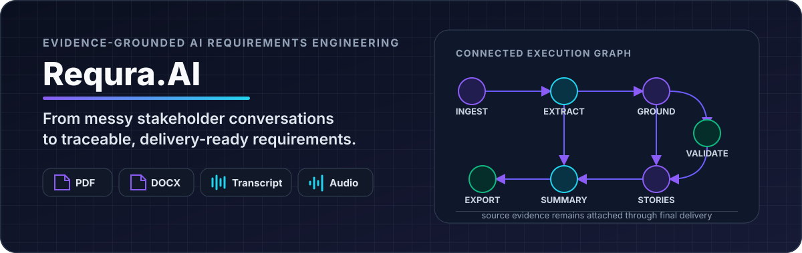
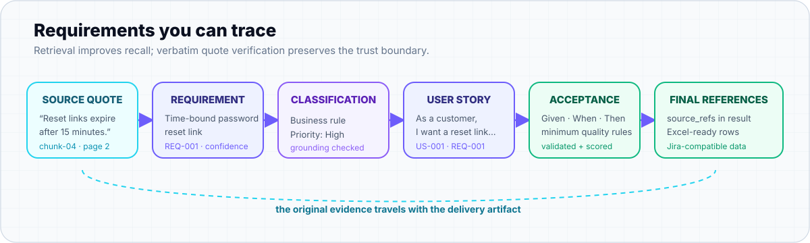

# Requra.AI — Business & Product Presentation

<p align="center">
  
</p>

<p align="center">
  <strong>From fragmented project context to traceable, review-ready requirements.</strong>
</p>

<p align="center">
  <a href="https://requra-ai-business-presentation.vercel.app"><strong>Live Presentation</strong></a>
  &nbsp;·&nbsp;
  <a href="https://requra-demo-rust.vercel.app/demo">Requra Product Demo</a>
  &nbsp;·&nbsp;
  <a href="https://github.com/Requra/ai-pipeline">AI Pipeline</a>
  &nbsp;·&nbsp;
  <a href="https://github.com/Requra/frontend">Product Frontend</a>
</p>

<p align="center">
  
  
  
  
</p>

---

## Overview

This repository contains the interactive **Requra.AI business and product presentation**. It explains Requra from a business-first perspective while keeping product claims grounded in the current Requra codebase.

It is deliberately not a technical architecture deck and not a static PowerPoint export. The same source works as:

- a cinematic full-screen desktop presentation,
- a responsive vertical narrative on tablets and phones,
- a public web experience hosted on Vercel,
- a print-friendly presentation when needed.

The visual system follows Requra's real product language: **Obsidian**, Requra **Violet**, restrained **Cyan**, evidence-oriented graphics, real product screenshots, and a deliberately varied slide rhythm.

## Production

**Live:** https://requra-ai-business-presentation.vercel.app

The site is framework-free and deploys as static files with no application build step.

## Why this presentation exists

Requra is strongest when it is explained as a solution to a business problem, not as a list of AI technologies.

The deck therefore follows this narrative:

> **fragmented stakeholder knowledge → requirements intelligence → human review → evidence-backed delivery**

The AI implementation supports the story; it does not replace the story.

## Visual storytelling system

The deck intentionally avoids repeating the same “headline + four cards” composition. Different ideas use different visual grammars so the audience can understand the concept before reading every sentence.

The current visual layer includes:

- **artifact anatomy** — source → requirement → story → acceptance criteria → delivery,
- **real traceability-chain artwork** from the Requra AI pipeline documentation,
- **generic AI vs Requra AI** trust comparison,
- **e-business ecosystem network** around shared requirements context,
- **qualitative STP market-fit map**,
- **qualitative competitive-positioning 2×2**,
- **SWOT strategy synthesis strip**,
- **4Ps strategy orbit**,
- **land → adopt → expand monetization path**,
- **GTM funnel + proof/adoption narrative**,
- **Business Model Canvas flow cue**,
- **roadmap horizon timeline**,
- real product screenshots with subtle evidence/product annotations.

### Credibility rule

The presentation does **not** invent percentages, market-size numbers, conversion rates or fake growth charts. Any non-measured business map is explicitly labeled as a **qualitative strategic hypothesis/comparison**.

That distinction is intentional: visual storytelling should improve comprehension without manufacturing evidence.

## Presentation structure

| # | Section | Message |
|---:|---|---|
| 01 | Vision | Turn project context into requirements teams can trust |
| 02 | Problem | Project knowledge rarely arrives as a clean backlog |
| 03 | Cost | Ambiguity compounds into wrong implementation and rework |
| 04 | Solution | Capture → Understand → Structure → Validate → Review → Deliver |
| 05 | Human system | Stakeholder ↔ Requra ↔ BA/PM → Engineering & QA |
| 06 | Product proof | Real implemented Requra product surfaces |
| 07 | Outputs | Requirements, stories, AC, summaries, coverage and exports |
| 08 | Requra AI | Evidence-grounded intelligence, not plausible prose |
| 09 | E-business | Collaboration, continuity, automation, traceability and scale |
| 10 | STP | Segmentation, targeting and positioning |
| 11 | Competition | Manual workflow vs generic AI vs Requra |
| 12 | SWOT | Strategic strengths, weaknesses, opportunities and threats |
| 13 | 4Ps | B2B-oriented marketing mix |
| 14 | Business model | Proposed B2B SaaS direction |
| 15 | GTM | Awareness → pilot → adoption → expansion |
| 16 | BMC | Full Business Model Canvas |
| 17 | Roadmap | Build trust first, expand intelligence second |

## Truth model: current vs proposed

The presentation visibly separates **implemented product truth** from **business recommendations**:

- **CURRENT PRODUCT** — supported by current Requra repositories and contracts.
- **PROPOSED** — recommended commercial strategy such as packaging, pricing direction, GTM or future positioning.

This prevents the deck from presenting an unfinalized pricing model or roadmap hypothesis as an existing feature.

## Requra AI concepts featured

The AI section stays business-readable while reflecting the actual requirements pipeline:

- PDF / DOCX / text ingestion,
- audio transcription when configured,
- structured requirement extraction,
- duplicate merging,
- BM25 evidence retrieval,
- optional hybrid/vector retrieval,
- evidence quote grounding,
- requirement classification,
- user-story and acceptance-criteria generation,
- quality validation and bounded repair,
- requirement-to-story coverage,
- source references and traceability,
- structured summaries,
- Excel-ready / Jira-compatible outputs.

The underlying AI service uses a 15-node LangGraph workflow; the deck explains the business consequence rather than forcing the audience through every implementation node.

<p align="center">
  
</p>

## Interaction

### Desktop

| Input | Action |
|---|---|
| `←` / `→` | Previous / next slide |
| `Page Up` / `Page Down` | Previous / next slide |
| `Space` | Next slide |
| Mouse wheel | Navigate slides |
| `O` | Slide overview |
| `F` | Fullscreen |
| `Home` / `End` | First / last slide |

### Mobile and tablet

Below the desktop breakpoint, the presentation becomes a **natural full-width vertical narrative** instead of shrinking a desktop slide canvas. This keeps type, product screens and business diagrams readable.

The experience also respects `prefers-reduced-motion`.

## Responsive hardening

The layout is explicitly designed for:

- short laptop viewports,
- standard 16:9 displays,
- ultrawide monitors,
- tablets,
- modern mobile devices,
- keyboard navigation,
- reduced-motion users.

The human-system slide received an important structural fix: **Engineering & QA is a real second grid row instead of an absolutely positioned card**, so it cannot collide with the explanatory caption on short displays.

The newer visual diagrams also include dedicated short-height and mobile rules: orbit diagrams become readable stacked systems, 2×2 charts retain axis labels, the roadmap switches to a vertical horizon, and multi-column flows collapse without hiding their meaning.

## Brand system

The presentation follows the Requra frontend design tokens:

| Token | Value |
|---|---|
| Obsidian | `#030014` |
| Primary Violet | `#7F56D9` |
| Cyan Accent | `#22C3D8` |
| Typeface | Inter / system sans fallback |

The goal is to feel unmistakably Requra — not like a generic purple “AI presentation” template.

## Repository structure

```text
.
├── index.html                 # shell, metadata and presentation chrome
├── script.js                  # navigation, overview, fullscreen, canvas motion
├── slides/
│   ├── part-1.html            # slides 01–06
│   ├── part-2.html            # slides 07–12
│   └── part-3.html            # slides 13–17
├── styles/
│   ├── part-1.css             # design system + core compositions
│   ├── part-2.css             # product, AI and strategy foundations
│   ├── part-3.css             # navigation + mobile behavior
│   ├── part-4.css             # print + short-height responsive hardening
│   └── part-5.css             # visual storytelling charts + illustrative systems
├── assets/
│   ├── requra-hero-dark.svg
│   ├── traceability-chain.svg
│   └── ASSET_SOURCES.md
├── vercel.json
├── .gitignore
└── README.md
```

The source is intentionally split into small static modules instead of one generated HTML file. That makes individual slides and responsive rules easy to review and edit on GitHub while keeping deployment effectively zero-overhead.

## Run locally

Because the shell fetches the slide fragments, serve the repository over HTTP rather than opening `index.html` via `file://`:

```bash
git clone https://github.com/shawky2002020/requra-ai-business-presentation.git
cd requra-ai-business-presentation
python -m http.server 8080
```

Then open:

```text
http://localhost:8080
```

Any equivalent static server works.

## Deploy to Vercel

This repo requires no framework preset, install step or build command.

With Vercel CLI:

```bash
vercel
vercel --prod
```

To connect the local repository to an existing Vercel project:

```bash
vercel link
vercel git connect
```

Production is currently served at **requra-ai-business-presentation.vercel.app**.

## Product visuals and asset provenance

Real Requra product screenshots and the robot logo are referenced from the public `Requra/frontend` repository and pinned to the audited frontend commit:

```text
db60a53ed2b3621a3a8bae4ac28c4563d7919814
```

This prevents presentation visuals from silently changing when the upstream `main` branch changes.

Requra AI documentation SVGs used by this repository are vendored locally for stable rendering. Full provenance is documented in [`assets/ASSET_SOURCES.md`](./assets/ASSET_SOURCES.md).

## Source-of-truth policy

Product claims were reviewed against:

- [`Requra/frontend`](https://github.com/Requra/frontend)
- [`Requra/ai-pipeline`](https://github.com/Requra/ai-pipeline)

Older proposal/MVP material is treated as historical product intent when it conflicts with current implementation.

## Technology

- semantic HTML5,
- modern CSS Grid / Flexbox / fluid sizing,
- vanilla JavaScript,
- Canvas hero animation,
- CSS reveal choreography,
- static Vercel hosting.

There are **no runtime package dependencies**.

## Credits

Built for **Requra.AI** as a business-first product narrative with evidence-backed product claims and the Requra visual system.

Requra product visuals and AI documentation assets remain attributed to the Requra repositories listed above.
